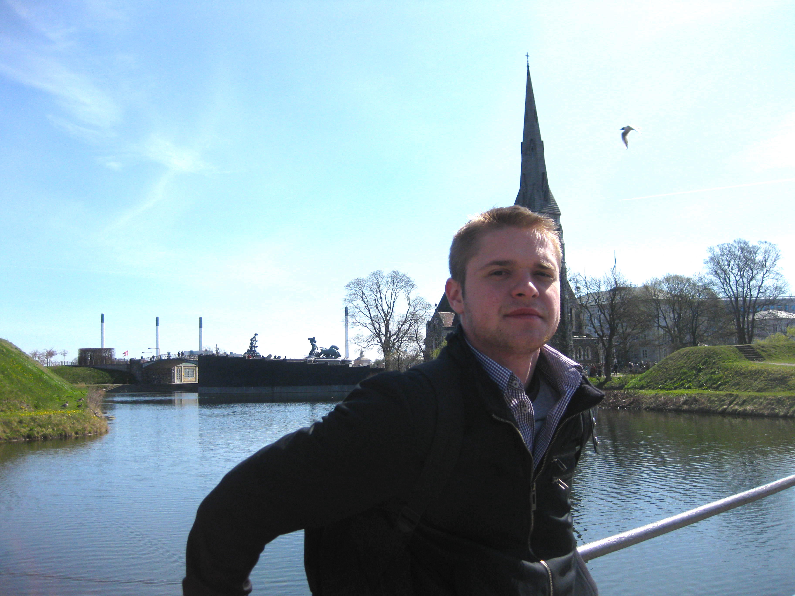
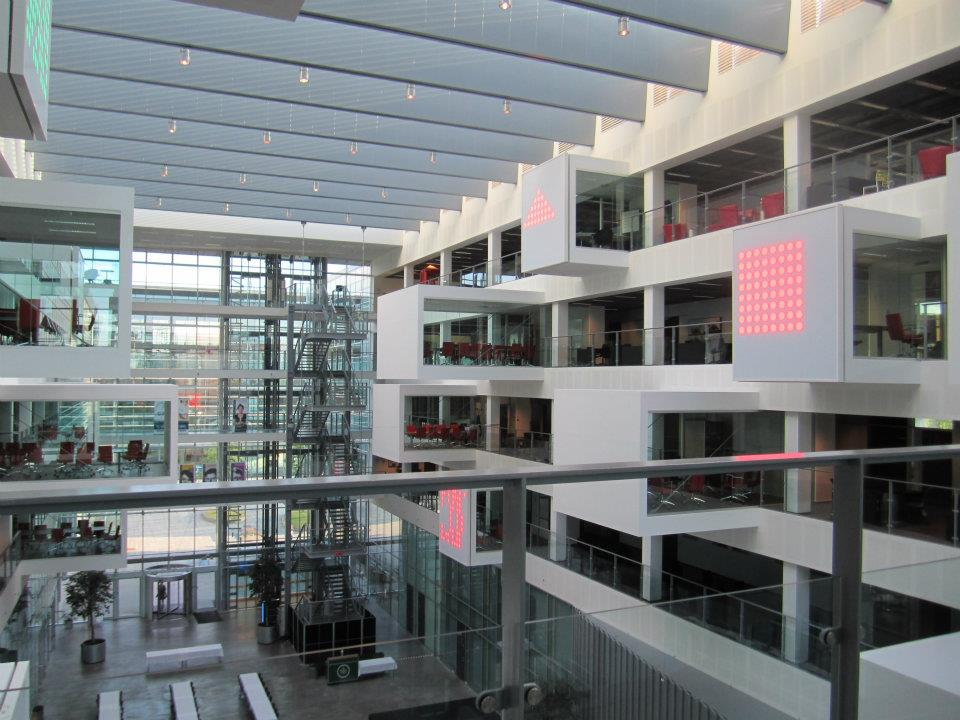

# The big decision

I remember the bewildered faces of my friends and family when I told them I am moving to Denmark. Why would I give up a career in one of Romania's top telecom companies? Why would I choose such a far away land? Will I be able to support myself in another country? Why would I go back to university, when I had such a good thing going for me in Bucharest? Well, I can't blame them for questioning my big decision. But I vividly recall that I had made up my mind and my plans already at the time. That is because I visited Copenhagen just 2 years before and I knew that is where I wanted to live. 

# Copenhagen charmed me 

Back when I lived in Bucharest, one of my good Romanian friends moved to Copenhagen to follow a higher educational degree. He was telling me how different (and how much better) life is for him there. How extremely impressed he was with Danish society as a whole, and particularly with living in Copenhagen. He was at times teasing me about still living in Bucharest, a crowded and polluted city "built for cars", and, unlike Copenhagen, a truly reprehensible city. I thought at the time that he was over exaggerating the lifestyle differences between the two cities. Later on, I came to realise he couldn't have been more accurate.

In April 2010 I hopped on a plane to visit the city I was hearing so much about. I had arranged for a 10-day trip so that I had enough time to explore. And I was in for a surprise.

> From the moment I stepped out of the plane and onto public transport, I was stunned. The people, the surroundings, and the dynamics were unlike anything I've seen.

I had been travelling a bit before Denmark, but there were a couple of things that immediately stuck out for me:

* the amazing design architecture 
* the thoughtfully planned urban spaces
* the politeness and kindness of people
* the high-tech public transport (driverless metro)
* the fast-changing weather (one minute sunny, next snowing)
* the multitude of bikes on the street

I didn't know it exactly back then, but it turns out Copenhagen had made a powerful impression on me. Just two years later, I was packing my bags for a longer stay.  

<figcaption>Contemplating about the new found land (2010)</figcaption>

# The best educational experience of my life

In March 2012 I was relocating to Copenhagen to start a Masters degree in Software Development with IT University of Copenhagen. I chose to follow a more technical degree that would challenge me and open up new career opportunities. I have visited the university before I applied, and I was so thrilled at the idea of me studying there. With its impressive glass and steel architecture, open space layout, and different art installations, it was by far the most remarkable academic building I had seen. Looking back now, not only that I was very lucky to have been accepted for the programme, but being a student there has profoundly re-defined my idea of school. 

#### Who knew school can be fun
One of my first cultural shocks (if we can call it that) was the number of recreational amenities the university was providing to its students. From gaming consoles, fusball tables and board games, to a fully-equipped student bar that was almost always open. I eventually found out this is not uncommon in other Danish universities, but all my past schools would have never considered providing such luxuries. The Romanian educational system simply does not believe in mixing work and play to such a degree, and I am sure others resonate. I of course realised throughout my studies that these amenities proved extremely useful and were there for a legitimate reason.   
> It was precisely this seamless combination of work and play at IT University of Copenhagen that made me feel I was in the right place

#### Studying with purpose
Another aspect that made an impact on me was the actual learning programme. I have had a total of 12 courses at ITU and all of them were wonderful. Highly skilled teachers were following a well-thought course description with the specific outcome of teaching students a practical skill or competence. Some course material was familiar to me from back home, but it somehow suddenly offered new insight. For example, I recall a specific "aha moment" at Discrete Mathematics. As I was fascinatedly paying attention to the course, it started to dawn on me. Oh! That is why set operations are important and **that is how you apply the knowledge in practice.** Although I had studied set operations as early as 5th grade, it is only now that they made sense from a practical perspective.

<figcaption>IT University of Copenhagen</figcaption>

#### Amazing environment
Probably the best facet of it all was the actual network of people. With a healthy and creative study environment, a gender distribution of 32% women and 68% men (at the time), and a highly international and diversified body of students, collaboration was at its best. I have met some truly amazing people at ITU, some of the smartest and creative persons I know. And have some great memories about my time there too. 

Someone asked a while ago on Quora about the experience at ITU. I have answered [here](https://www.quora.com/Does-IT-University-of-Copenhagen-live-up-to-its-price).

# Getting a job

